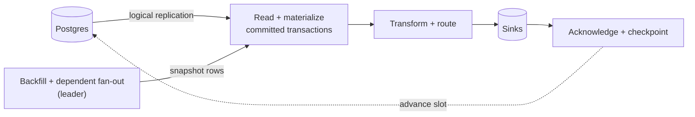

# How it works

Wallaby runs a single ordered pipeline per slot. It reads committed transactions from Postgres logical
replication, materializes each row change into your mapped EF Core entity, transforms it into a document,
and delivers it to your sinks. **Only after every sink accepts the batch** does it acknowledge the commit
and advance the slot — that ordering is what gives at-least-once delivery, since a crash simply re-streams
from the last acknowledged position.

## The pipeline

- **Read + materialize** — decode each committed transaction and turn its row changes into typed
  `ChangeEvent`s.
- **Transform + route** — group by mapping, run each [transform](/transforms) to shape documents, and slice
  the result into batches of at most [`MaxBatchSize`](/getting-started#options).
- **Sinks** — deliver each batch (with retry/backoff).
- **Acknowledge + checkpoint** — once everything is delivered, advance the replication slot and persist the
  checkpoint.

[Backfill](/backfill) (initial snapshots) and [dependent fan-out](/transforms#dependent-tables) (re-emitting
an entity when a related table changes) run on the leader and feed rows through the **same** transform and
sink path, so there is only ever one ordered stream.

## Prior Art

Many concepts this package uses are based on existing patterns within the wider ecosystem:
- The transformation, enrichment and watermarking pipeline is inspired by [Sequin](https://sequinstream.com/)
- Some general concepts are based on Netflix's [DBLog](https://netflixtechblog.com/dblog-a-generic-change-data-capture-framework-69351fb9099b)